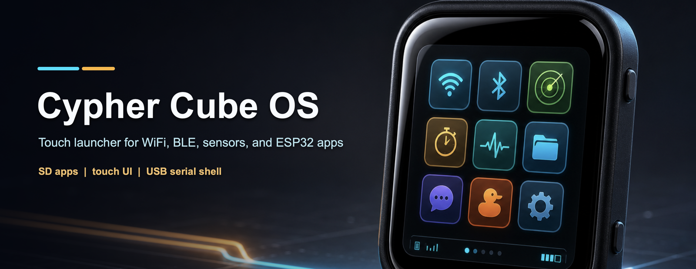

# Cypher Cube

Cypher Cube is a pocket-sized touchscreen launcher for local ESP32 apps. Flash
the launcher once, copy app binaries to a microSD card, then tap the app you
want to run.

It is built for the Waveshare ESP32-S3-Touch-AMOLED-1.8, but the experience is
branded around the Cypher Cube: a small, local-first device for WiFi/BLE tools,
utilities, diagnostics, and experiments you can actually carry around.

## What It Does

- Touchscreen app launcher with SD-card app installs.
- One-tap app switching without reflashing from your computer each time.
- USB serial fallback shell for status, app listing, install, erase, and boot
  commands.
- BOOT button shortcuts for back, home, and force-launcher recovery.
- Shared onboard hardware support for battery, clock, motion, WiFi, BLE, SD,
  display, touch, and audio.

## Included Apps

The current Cypher Cube catalog includes:

- **Pomodoro** - Focus timer with battery and time display.
- **Tricorder** - One-screen dashboard for battery, clock, IMU, and nearby WiFi.
- **Cypher Cube WiFi Tools** - WiFi scan, channel heatmap, captive portal, active
  WiFi lab tools, read-only SD web server, and serial commands.
- **Cypher Cube BLE Tools** - BLE Serial, BLE scan/export, BLE advertising lab
  tools, HID payload launcher, mouse jiggler, pairing tools, and serial commands.
- **Cypher Drive** - Direct AMOLED build from the Cypher Drive project.
- **Cypher Chat** - Direct AMOLED build from the Cypher Chat project.
- **Flock You** - Direct AMOLED build from the Flock You project.
- **SD Status** - SD card and catalog path diagnostic.
- **Touch Diagnostics** - Touchscreen and display sanity check.

Per-app notes live in [docs/apps](docs/apps/README.md).

## Device Hardware

Cypher Cube currently targets:

- ESP32-S3R8 with 8 MB PSRAM and 16 MB flash
- 368x448 SH8601 QSPI AMOLED display
- FT3168 capacitive touch
- microSD card slot over SD_MMC
- BOOT button fallback input
- AXP2101 battery/PMU
- PCF85063 real-time clock
- QMI8658 6-axis IMU
- ES8311 mic and speaker path
- WiFi, BLE, and USB serial

More hardware notes are in [docs/hardware.md](docs/hardware.md).

## Build It

This repo is Arduino CLI only. The short version:

```bash
./tools/build-launcher.sh
./tools/build-apps.sh
./tools/package-sd.sh
./tools/flash-launcher.sh /dev/cu.usbmodemXXXX
```

Full setup, dependency, flashing, SD-card, and app-porting instructions are in
[docs/technical-instructions.md](docs/technical-instructions.md).

## Safety And Scope

Some included WiFi and BLE apps are security lab tools. Use them only on
networks, devices, radios, and hosts you own or have explicit permission to test.

NFC, APDU Lab, tag emulation, GPS, and wardriver features are intentionally not
included in the current Cypher Cube catalog because they require external
PN532/GPS hardware. Legacy Cardputer Lite and GameOS folders may exist in the
repo, but they are not part of the supported catalog.

This project is intentionally single-target and local-first: no PlatformIO,
ESP-IDF project files, online OTA catalogs, USB mass storage flow, WebUI, or
multi-board support unless the scope changes.
